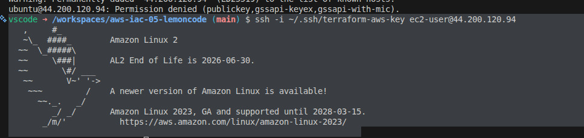
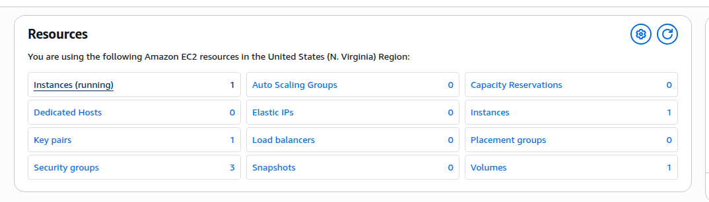
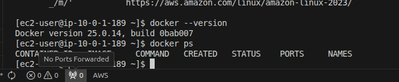
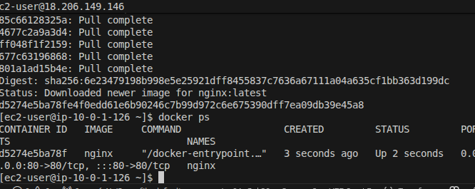
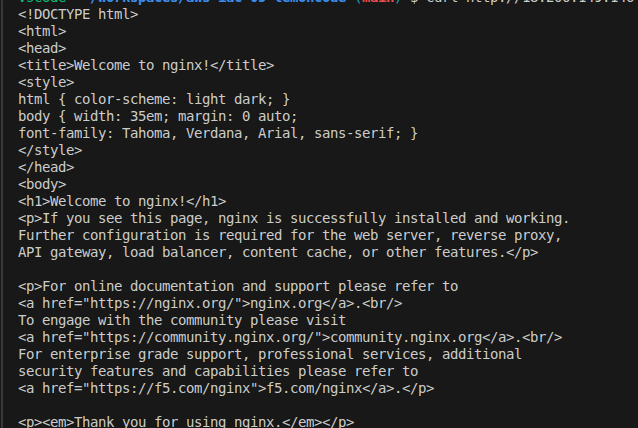

# AWS IAC - Terraform Exercise

## Descripción

Proyecto educativo de Terraform que provisiona una infraestructura completa en AWS incluyendo:
- VPC con subnet pública
- Internet Gateway y enrutamiento
- Security Groups (HTTP y SSH)
- EC2 instance con Docker
- NGINX container en Docker

---

## Pre-requisitos

### 1. Generar SSH Key

Cada usuario debe generar su propia SSH key antes de ejecutar Terraform:

```bash
ssh-keygen -t rsa -b 4096 -f ~/.ssh/terraform-aws-key -N ""
```

Esto crea:
- `~/.ssh/terraform-aws-key` (private key - NUNCA compartir)
- `~/.ssh/terraform-aws-key.pub` (public key - importada a AWS)

### 2. Configurar AWS CLI

Las credenciales de AWS se deben configurar una sola vez en tu máquina:

```bash
aws configure
```

Se te pedirá:
- AWS Access Key ID: Tu clave de acceso (de AWS Console)
- AWS Secret Access Key: Tu clave secreta (de AWS Console)
- Default region name: `us-east-1`
- Default output format: `json`

Las credenciales se guardan en `~/.aws/credentials` (protegido por .gitignore).

Verificar que funciona:

```bash
aws sts get-caller-identity
```

### 3. Inyectar tu IP pública como variable de entorno

En lugar de hardcodear la IP en archivos de configuración, úsala como variable de entorno:

```bash
export TF_VAR_my_ip="$(curl -s https://api.ipify.org)/32"
echo $TF_VAR_my_ip
```

Esta práctica es más segura y sigue las recomendaciones de best practices para evitar comprometer datos sensibles en el código.

Alternativa manual (menos recomendada):

```bash
curl https://api.ipify.org  # Obtener tu IP
# Editar terraform.tfvars: my_ip = "TU_IP/32"
```

---

## Configuración

### Paso 1: Obtener credenciales de AWS

1. Acceder a AWS Console
2. IAM → Users → Crear Access Key
3. Copiar Access Key ID y Secret Access Key

### Paso 2: Configurar AWS CLI

```bash
aws configure
```

### Paso 3: Valores por defecto en terraform.tfvars

Los valores ya están configurados en el archivo:

```hcl
aws_region         = "us-east-1"
project_name       = "aws-iac-05-lemoncode"
environment        = "learning"
vpc_cidr           = "10.0.0.0/16"
public_subnet_cidr = "10.0.1.0/24"
```

Para cambiar valores, edita `terraform.tfvars` o usa flags: `terraform plan -var="aws_region=eu-west-1"`

---

## Ejecución completa del ejercicio

### Paso 1: Inicializar Terraform

```bash
terraform init
```

### Paso 2: Ver plan de cambios

```bash
terraform plan
```

### Paso 3: Crear infraestructura

```bash
# Inyectar IP pública como variable de entorno
export TF_VAR_my_ip="$(curl -s https://api.ipify.org)/32"

# Crear la infraestructura
terraform apply
```

### Paso 4: Obtener IP pública de la instancia

```bash
terraform output instance_public_ip
```

Este comando te mostrará algo como: `44.200.120.94`

### Paso 5: Conectar por SSH a la instancia

```bash
# Reemplaza <PUBLIC_IP> con la IP del paso anterior
ssh -i ~/.ssh/terraform-aws-key ec2-user@<PUBLIC_IP>
```

Una vez conectado, verifica que Docker está instalado:

```bash
docker --version
```

### Paso 6: Desplegar NGINX en Docker

Dentro de la instancia (vía SSH), ejecuta:

```bash
docker run -d -p 80:80 --name nginx nginx
```

Verifica que el contenedor está corriendo:

```bash
docker ps
```

Salir de SSH:

```bash
exit
```

### Paso 7: Probar que NGINX responde en HTTP

Desde tu máquina local (en el container), prueba:

```bash
# Opción 1: curl
curl http://<PUBLIC_IP>

# Opción 2: acceder desde navegador
# Abre: http://<PUBLIC_IP>
```

Deberías ver la página por defecto de NGINX con el mensaje "Welcome to nginx!".

### Destruir la infraestructura

Cuando termines de hacer pruebas, destruye los recursos para evitar costos:

```bash
terraform destroy
```

---

## Decisiones técnicas

### Región: us-east-1

Se eligió us-east-1 por varias razones:
- Región con mayor disponibilidad de servicios free tier
- Mejor compatibilidad con instancias t3.micro (que es free tier)
- Región más económica para experimentación educativa
- Soporte completo para todos los recursos del ejercicio (VPC, IGW, EC2, Security Groups)

La región se puede cambiar editando `terraform.tfvars`, pero esto puede afectar la disponibilidad de free tier según tu cuenta.

### Instancia: t3.micro

Se utiliza t3.micro en lugar de t2.micro porque:
- Ambas son free tier eligible
- t3.micro es más moderna y eficiente
- Mejor rendimiento para ejecutar Docker
- Soportada en todas las availability zones de us-east-1

Si tu cuenta no soporta t3.micro, el `terraform apply` lo indicará. En ese caso, cambia el valor en `locals.tf`.

### Información sensible

- Las credenciales de AWS nunca se hardcodean en archivos versionados
- La IP de acceso SSH se inyecta como variable de entorno
- El archivo `.tfstate` (estado de Terraform) está en `.gitignore` para proteger datos sensibles
- Las SSH keys privadas están excluidas del repositorio

---

## Estructura de archivos

- `provider.tf` - Configuración de proveedor AWS
- `variables.tf` - Declaración de variables
- `terraform.tfvars` - Valores específicos por ambiente
- `locals.tf` - Variables locales calculadas
- `network.tf` - Recursos de red (VPC, subnet, IGW, route table, Security Group)
- `keypair.tf` - SSH key pair resource
- `ec2.tf` - EC2 instance con user_data
- `outputs.tf` - Valores de salida (IP pública, IDs de recursos, etc)
- `user_data.sh` - Script bash ejecutado al iniciar la instancia (instala Docker)
- `.devcontainer/devcontainer.json` - Configuración del dev container

---

## Debugging

Comandos útiles para troubleshooting:

```bash
# Ver todas las variables y sus valores
terraform console

# Ver el estado actual de los recursos
terraform show

# Ver logs detallados
TF_LOG=DEBUG terraform plan

# Validar sintaxis
terraform validate

# Formatear código
terraform fmt
```

---

## Pruebas realizadas

### SSH Connection



### Instance created in AWS



### Docker installation verified




###Nginx installed



###Nginx connected

---

**Última actualización**: 2026-04-28